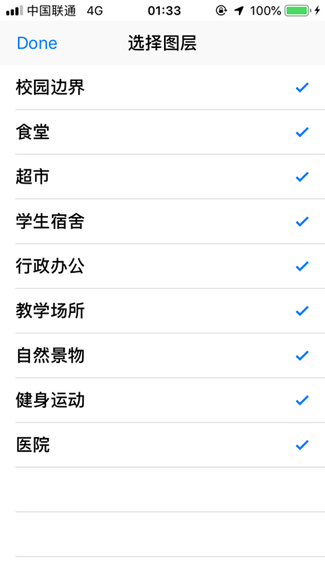

# CampusMap
本项目是[app-2018f课程](https://github.com/njuics/app-2018f)的作业，在[原始项目](https://github.com/idupclub/CampusMap)的基础上实现一个校园导航app。

## 开发、测试环境
- XCode 10.1 (10B61)
- macOS Mojave 10.14.1 (10B61)
- iOS 12.1(16B92)

## 实现效果
- 点击主界面右上角选择显示图层

- 主界面

- 点击某个按钮，会出现简介与“去这里”按钮

- 点击“去这里”,界面出现一个上拉页面（具体实现参考自[Stack Overflow](https://stackoverflow.com/questions/37967555/how-can-i-mimic-the-bottom-sheet-from-the-maps-app/38152508#38152508)），此时：

1、地图上有一条绿色的路线图

2、上拉页面有详细的导航说明，其左侧有2个按钮，分别是“重新加载”与“退出导航”

